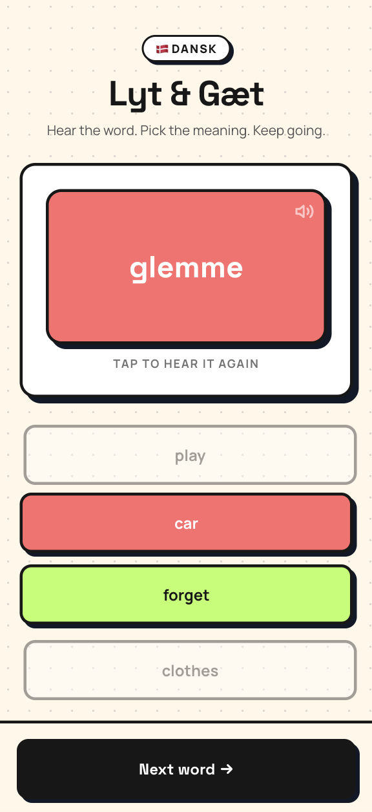

# Lyt & Gæt

A simple Danish listening game. Hear a Danish word, choose its English meaning, and keep practicing.

**Live app:** https://appunni.github.io/dan-word/



## Features

- 418 everyday Danish words with English translations
- Danish pronunciation using your browser's built-in speech voice
- Four-choice listening practice with replay support
- Incorrect answers appear more often for extra practice
- A 50-word no-repeat window that continues across sessions
- No score or timer — just practice at your own pace

## Run locally

```bash
npm install
npm run dev
npm run build
npm run preview
```

## Deployment

Every push to `main` is built and deployed to GitHub Pages. The one-time Pages setting is **Settings → Pages → Source → GitHub Actions**.

## Built with

Vite, TypeScript, Tailwind CSS, and the Web Speech API.
